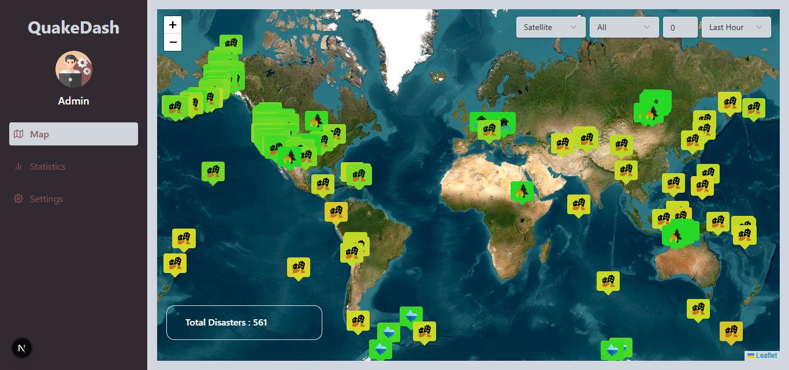
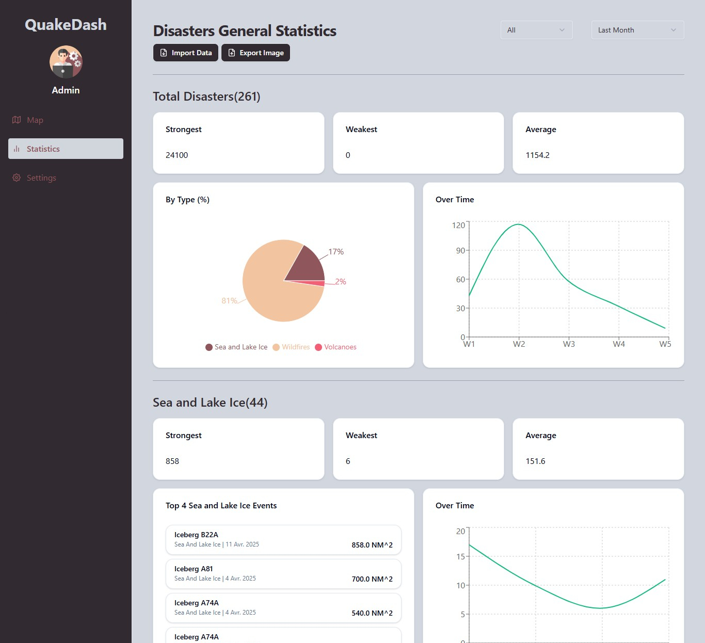
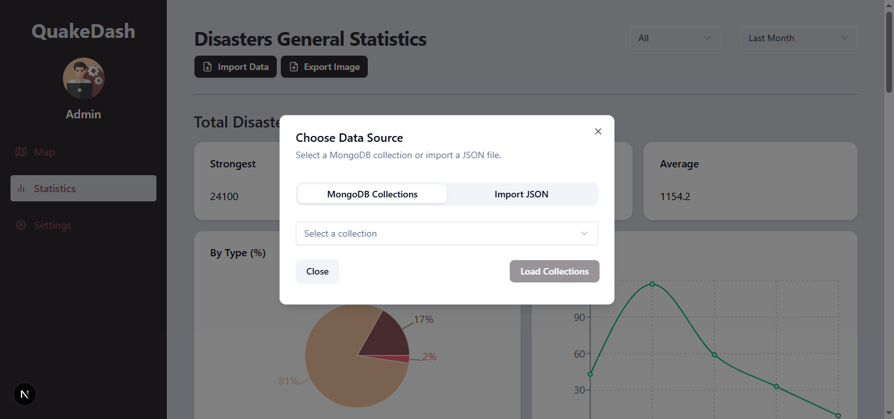

# 🌍 Disasters Realtime Map and Stats Dashboard

A web application that visualizes real‐time and batch disaster data (earthquakes, wildfires, icebergs, floods, etc.) on an interactive map and rich statistics panels. Built on Next.js with a MongoDB backend and integrated into a larger Big Data pipeline.

## 🎯 Purpose of the Project

Part of a **Big Data pipeline** for:

- 🔄 **Streaming ingestion** (Spark Structured Streaming) of multiple sources (USGS, EONET, GDACS)  
- 🗃️ Storage in MongoDB & HDFS  
- 🧮 **Batch processing** with Spark for cleaning, aggregations, and historical stats  
- 📊 **Visualization** with this dashboard (Leaflet, Recharts)  

The goal is to let users explore both **live** and **historical** disaster events filtered by time, magnitude/size, and type.

## 🚀 Features

### Map & Live Data

- 🗺️ **Interactive 2D map** (Leaflet) with switchable street/satellite layers  
- 🔀 **Multiple disaster sources** (USGS earthquakes, EONET events, GDACS alerts) merged into one “disaster” feed  
- 🎯 **Filters** by:
  - Time range: Last hour / day / week / month  
  - Minimum magnitude/size  
  - Disaster type (Earthquake, Wildfires, Sea & Lake Ice, Flood, Explosion, etc.)  
- 🟢🔴 **Color‐coded, icon‐driven markers** on the map, with size and hue proportional to severity


### Batch Statistics

- 📈 **General stats** (total events, strongest, weakest, average) per source or type  
- 📊 **Pie chart** showing % distribution of event types  
- 📉 **Bar/line charts** for:
  - Magnitude/size distribution (dynamic scales per type)  
  - Events over time (minute/hour/week buckets)  
  - Top affected regions  
- 🏆 **Top-N dangerous events** list, styled with ShadCN/UI cards  
- 📦 **Import JSON** files of additional disaster data, seamlessly merged into exportable report  

### PDF & Image Export

- 📄 **Export entire statistics panel** (grouped two sections per page) to multi‐page PDF  
- 🖼️ **Download as high‐resolution PNG** of the full stats section  

## 🏗️ Tech Stack

- **Next.js** (App Router, React 18)  
- **Leaflet** for mapping, dynamic `divIcon` marker overlays  
- **Recharts** for all charts (Bar, Line, Pie)  
- **ShadCN/ui** & **TailwindCSS** for UI components & styling  
- **html2canvas-pro** + **jsPDF** (or direct PNG) for client‐side export  
- **MongoDB** (collections: `usgs`, `eonet`, `gdacs`, plus user‐imported JSON)  

## 🔧 Getting Started

1. Clone the repository:
   ```bash
   git clone https://github.com/AlaBhs/quakedash.git
   cd quakedash
   ```

2. Install dependencies:
   ```bash
   npm install
   ```

3. Run the development server:
   ```bash
   npm run dev
   ```

4. Open `http://localhost:3000` in your browser.

## 📷 Screenshots

### 🌍 Real Time Map View


### 📈 Statistics View


### 🔍 Import JSON Files Or From Mongodb Collections Feature



## 📄 License

MIT License – [AlaBhs](https://github.com/AlaBhs)
